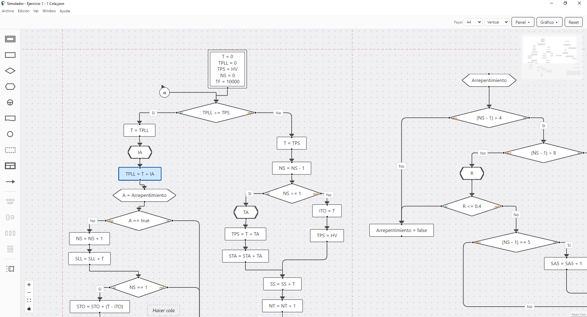
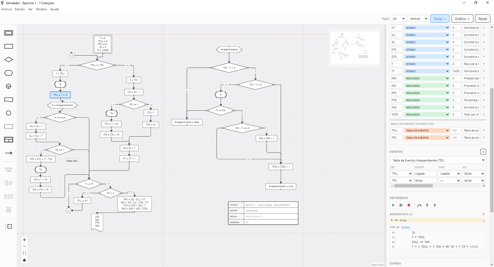
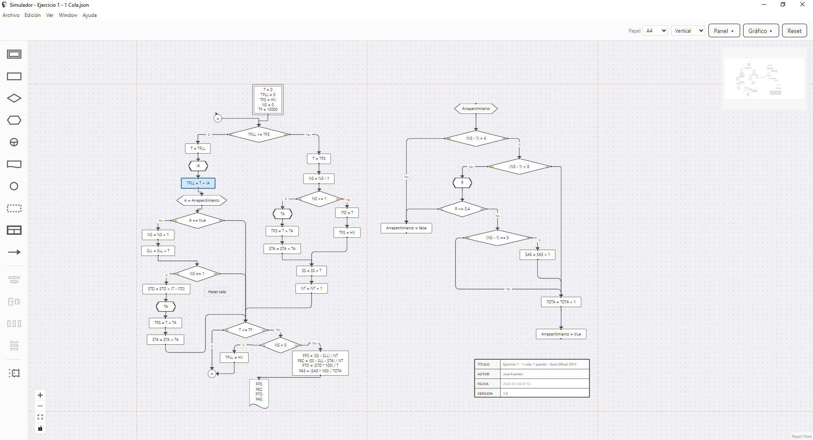
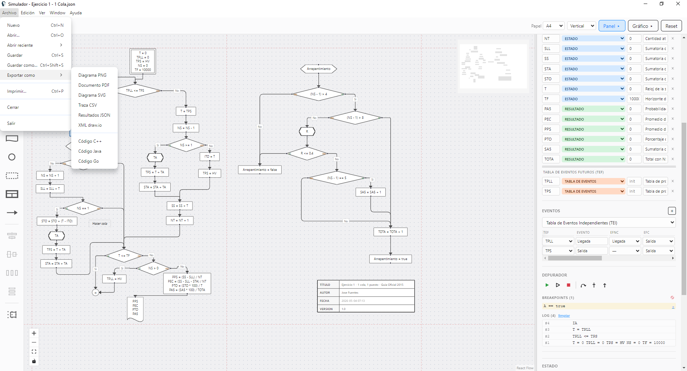
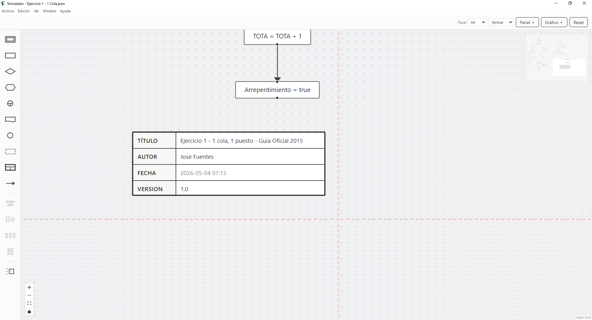

# Simulador

> **Open source · Multiplataforma · Multi-idioma**



Editor visual de diagramas para dos metodologías de simulación:

- **Simulación de eventos discretos (DES)** — diagramas de flujo ejecutables paso a paso con breakpoints, graficación de variables y exportación a múltiples formatos. Soporta los métodos *Evento a Evento* (EaE) y *Δt Constante*. Bloques de generación de datos a partir de expresiones JavaScript.
- **Simulación dinámica continua (estilo Stella/iThink)** — diagramas causales con Stocks, Flows, Converters y Action Connectors, integración por Euler, ecuaciones auto-generadas a partir del modelo y soporte para funciones gráficas.

El tipo de simulación se elige desde el combo *Tipo* del panel lateral; toda la UI (toolbar, inspector, panel de ejecución) se adapta al modo activo.

**Autor**: Jose Fuentes ([@josefuentes4096](https://github.com/josefuentes4096)).
**Base académica**: Basado en la materia *Simulación* — UTN FRBA, Ingeniería en Sistemas de Información.
**Licencia**: [MIT](LICENSE) — código abierto, libre uso y modificación.

> Este software es un proyecto personal y no constituye material de ninguna cátedra.

---

## Características principales

### Multiplataforma
Funciona como aplicación de escritorio nativa en **Windows**, **macOS** y **Linux** (Electron + React). Instaladores precompilados para los tres sistemas operativos.

### Multi-idioma
Interfaz, errores y diálogos disponibles en **español**, **inglés** y **portugués**. El idioma se cambia desde *Edit → Preferences* y se aplica al instante en toda la app — incluyendo el menú nativo.

### Funciones de debug estilo IDE (modo discreto)
Inspirado en Visual Studio: **F5** corre, **F10** Step Over, **F11** Step Into, **Shift+F11** Step Out, **F9** alterna breakpoints, **Ctrl+F5** ejecuta sin debug. El panel *Debugger* del sidebar muestra en tiempo real la lista de breakpoints, el log de ejecución y los iconos clásicos de continuar / detener / avanzar.



### Simulación dinámica (Stella/iThink)
Modo dedicado de **diagramas causales continuos** activable desde el combo *Tipo*. Cuatro bloques principales:

| Bloque | Rol |
|---|---|
| **Stock** | Acumulador (rectángulo). Cambia por integración a partir de los flujos. |
| **Flow** | Tubería con válvula que llena o drena un Stock. Si tiene un extremo libre se materializa una *Cloud* automáticamente. |
| **Converter** | Constante, fórmula o función gráfica (círculo). |
| **Action Connector** | Flecha de dependencia entre Stock/Flow/Converter → Flow/Converter. |

- **Lenguaje de expresiones** completo: aritmética, lógicos (`AND`/`OR`/`NOT`), comparaciones, `IF/THEN/ELSE`, builtins (`PULSE`, `STEP`, `RAMP`, `RANDOM`, `NORMAL`, `POISSON`, `EXP`, `LOG10`, `SIN`, `MAX`, `MIN`, etc.) y los specials `TIME`, `DT`, `STARTTIME`, `STOPTIME`.
- **Validación en vivo** de Required Inputs: el inspector muestra los inputs que llegan por Connector y marca en rojo cualquier referencia inconsistente con la ecuación.
- **Detección de ciclos algebraicos**: los Connectors entre Converters/Flows que formen un ciclo sin pasar por un Stock se rechazan al crearlos (regla del manual: "insertar un Stock para romper el ciclo").
- **Tab Equation**: vista textual auto-generada del modelo (formato `S(t) = S(t - dt) + (in - out) * dt`, `INIT`, secciones `INFLOWS`/`OUTFLOWS`).
- **Run Specs panel**: From / To / DT / Time unit / Integration method (Euler con RK2/RK4 en roadmap). El motor produce trayectorias muestreadas a paso DT.
- **Editor de funciones gráficas**: modal con curva editable por click-drag o por columna numérica; modos continuo (interpolación lineal) y discreto (escalonado).

### Impresión multi-página
Permite dividir un diagrama en varias páginas.



### Formatos de exportación del diagrama

| Formato | Uso típico |
|---|---|
| PDF | Mantiene calidad vectorial. |
| draw.io | Compatible con [diagrams.net](https://app.diagrams.net/). |
| PNG | Imagen rasterizada para slides o capturas. |
| SVG | Vectorial editable en Illustrator/Inkscape. |
| CSV | Trace de la simulación para análisis en Excel/R/Python. |
| JSON | Resultados completos (snapshot + trace + event log). |
| C++ / Java / Go | Código fuente equivalente al diagrama. |



### Edición avanzada del canvas
Snap-to-grid opcional (con grilla de fondo visible), guías de alineación dinámicas al arrastrar, botones de alinear vertical/horizontal y distribuir uniformemente, paleta lateral con icono por tipo de bloque, modo conexión click-a-click, copy/cut/paste con `Ctrl+C/X/V`, undo/redo de 50 niveles.

### Title block
Bloque con campos editables (Título / Autor / Versión) que se sincronizan con el `metadata` del JSON. La fecha se toma automáticamente del mtime del archivo en disco. Cada save actualiza un contador de build (`X.Y.Z.B`) embebido en el footer.



---

## Descargar e instalar

### Opción A — Descargar el instalador (recomendada)

1. Abrir la [página de Releases](https://github.com/josefuentes4096/simulador/releases/latest) del repositorio.
2. Descargar el archivo correspondiente al sistema operativo:
   - **Windows**: archivo terminado en `.exe` (instalador NSIS).
   - **macOS**: archivo terminado en `.dmg`.
   - **Linux**: archivo terminado en `.AppImage`.
3. Hacer doble click sobre el archivo descargado y seguir los pasos del instalador.
4. La primera vez que se abra la aplicación, el sistema operativo puede pedir confirmación porque el binario no está firmado:
   - **Windows**: click en *Más información* → *Ejecutar de todas formas*.
   - **macOS**: click derecho sobre la app → *Abrir* (en lugar de doble click).
   - **Linux** (`.AppImage`): hacer el archivo ejecutable con `chmod +x Simulador-*.AppImage` y después doble click o ejecutar desde la terminal.

### Opción B — Compilar desde el código fuente

Para desarrolladores, o si la versión publicada no incluye un instalador para tu sistema operativo. Requiere instalar **Node.js 20 o superior**.

1. **Instalar Node.js**: descargar el instalador LTS desde [nodejs.org](https://nodejs.org/) y ejecutarlo con todas las opciones por defecto.
2. **Descargar el código**: en la página principal del repositorio, click en el botón verde `<> Code` → `Download ZIP`. Descomprimir el `.zip` en una carpeta a elección (por ejemplo `C:\Simulador` en Windows o `~/Simulador` en macOS/Linux).
3. **Abrir una consola**:
   - **Windows**: tecla `Win + R`, escribir `cmd` y presionar Enter.
   - **macOS**: aplicación *Terminal* (Spotlight: `Cmd + Espacio`, escribir "Terminal").
   - **Linux**: terminal del entorno (Ctrl+Alt+T en muchas distros).
4. **Posicionarse en la carpeta del código** (al descomprimir, GitHub crea típicamente una carpeta tipo `simulador-main/`):
   ```
   cd C:\Simulador\simulador-main
   ```
   (cambiar la ruta según dónde se descomprimió el ZIP; en macOS/Linux usar `/` en lugar de `\`).
5. **Instalar las dependencias** (la primera vez tarda 1-3 minutos — descarga ~250 MB):
   ```
   npm install
   ```
6. **Levantar la aplicación**:
   ```
   npm run dev
   ```
   Se abre la ventana del Simulador. Para cerrar, cerrar la ventana o presionar `Ctrl+C` en la consola.

---

## Configurar el repositorio de resoluciones

La aplicación puede sincronizar el catálogo de ejercicios resueltos contra un repositorio público de GitHub.

1. Abrir la aplicación.
2. **Edit → Preferences…** (`Ctrl+,`).
3. En la sección **Repositorio de resoluciones**, pegar la URL pública de GitHub que apunta al directorio con los `.json`. Ejemplo:
   ```
   https://github.com/<usuario>/<repo>/<directorio>
   ```
4. Click en **Guardar URL** y después en **Actualizar desde el repo**: descarga el listado y lo cachea localmente.
5. Cerrar el modal.

La carpeta `example-resolutions/` del propio repositorio sirve de plantilla para la estructura esperada de cada `.json`.

---

## Uso básico

- **Modelo nuevo**: menú **File → New** (`Ctrl+N`).
- **Abrir un archivo existente**: **File → Open…** (`Ctrl+O`). El menú **Open Recent** muestra los últimos 10.
- **Guardar**: **File → Save** (`Ctrl+S`) — exporta un `.json` canónico (key-order estable) apto para versionar en git. Un mismo archivo puede contener tanto la sección discreta como la dinámica; el combo *Tipo* del sidebar elige cuál editar.
- **Elegir metodología**: combo *Tipo* del panel lateral → *Evento a Evento (EaE)* / *Δt Constante* / *Simulación Dinámica*. La toolbar y el inspector cambian según el modo.

**Modo discreto (EaE / Δt Constante):**
- **Correr la simulación**: panel *Debugger* del sidebar derecho, o **F5**. Resultados (estado / log / trace) aparecen en el sidebar.
- **Paso a paso**: **F11** Step Into · **F10** Step Over · **Shift+F11** Step Out · **F9** alterna breakpoint en el bloque seleccionado.
- **Gráficos**: botón **Chart** del toolbar abre el panel inferior con las variables numéricas seleccionables.

**Modo dinámico (Stella):**
- **Crear bloques**: botones de la toolbar (Stock, Converter, Comment, Label).
- **Crear flows**: activar la herramienta *Flow* → click en el Stock origen → click en el Stock destino. Click en espacio vacío crea automáticamente un Cloud (libre) en cualquiera de los dos extremos.
- **Crear connectors**: activar la herramienta *Action Connector* → click en el bloque origen → click en el destino.
- **Editar bloques**: seleccionar el bloque y completar los campos del inspector (Name, Initial value, Equation, Units, Documentation, etc.).
- **Ver ecuaciones**: tab *Ecuaciones* arriba del canvas — vista textual generada automáticamente.
- **Ejecutar**: panel *Run Specs* del sidebar — definir From/To/DT/Integration method y presionar *Ejecutar*.

**Comunes a todos los modos:**
- **Imprimir**: **File → Print…** (`Ctrl+P`) — imprime la tabla de variables y de eventos, más el diagrama en formato multi-página automática.
- **Exportar**: **File → Export As →** PDF / PNG / SVG / draw.io / CSV / JSON / C++ / Java / Go.
- **Preferencias** (idioma, repositorio de resoluciones): **Edit → Preferences…** (`Ctrl+,`).

---

## Estructura del repositorio

```
packages/             # código fuente (workspaces npm)
  shared/             #   tipos compartidos y JSON schema del modelo (DES + dynamic)
  app/                #   proceso main de Electron y preload (incluye i18n del menú nativo)
  ui/                 #   renderer React (Vite)
    src/
      components/     #     canvas, sidebar, paneles, paleta, edges
      sim/            #     flowchartStepper.ts (DES) + dynamicStepper.ts (continuo)
      dynamic/        #     parser/evaluador de expresiones + equation generator
      locales/        #     catálogos i18n {es,en,pt}/common.json
      export/         #     exportadores (drawio, sourceCode, pdf, etc.)
example-resolutions/  # archivos .json de ejemplo para el repositorio de resoluciones
LICENSE
README.md
package.json
```

Dos motores de simulación independientes corren en el renderer:
- `packages/ui/src/sim/flowchartStepper.ts` — paso a paso del modo discreto.
- `packages/ui/src/sim/dynamicStepper.ts` — integración Euler del modo dinámico, con orden topológico de Converters/Flows y clamping non-negative en Stocks.

---

## Publicar un release

Los binarios para los tres sistemas operativos se construyen y publican automáticamente vía **GitHub Actions**. El flujo:

1. Bumpear la versión en `package.json` y `packages/app/package.json` (campo `version`).
2. Commit y push a `main`.
3. Crear un tag con la nueva versión:
   ```
   git tag v0.1.0
   git push --tags
   ```
4. El workflow `.github/workflows/release.yml` corre automáticamente: lanza tres jobs paralelos (Windows, macOS, Linux), compila la app y sube los instaladores a un *draft release* en GitHub.
5. Ir a la página de **Releases** del repositorio en GitHub, abrir el draft generado, revisar los archivos adjuntos, y click en **Publish release**.

A partir de ese momento los usuarios pueden descargar los instaladores desde la página de Releases.

El workflow `.github/workflows/ci.yml` corre en cada push y PR (typecheck + tests + lint) para detectar regresiones antes de un release.

---

## Finalidad y contribuciones

La finalidad de este software es **puramente académica**.

Una característica de la aplicación es que **mantiene un catálogo sincronizado de ejercicios resueltos desde repositorios públicos de GitHub** (configurables desde *Edit → Preferences*).

Se aceptan contribuciones de dos tipos:

- **Código** sobre este repositorio: mejoras a la aplicación, correcciones de bugs, funcionalidades nuevas.
- **Ejercicios resueltos** sobre el repositorio público de resoluciones (el que la aplicación cachea al hacer *Actualizar desde el repo*): agregar archivos `.json` siguiendo la estructura de los ejemplos en `example-resolutions/`.

Para contribuir, abrir un *Pull Request* en GitHub.

---

## Licencia

[MIT](LICENSE) — Copyright © 2026 Jose Fuentes. Uso, copia, modificación y distribución libres, incluso con fines comerciales, manteniendo el aviso de copyright. Sin garantías.
